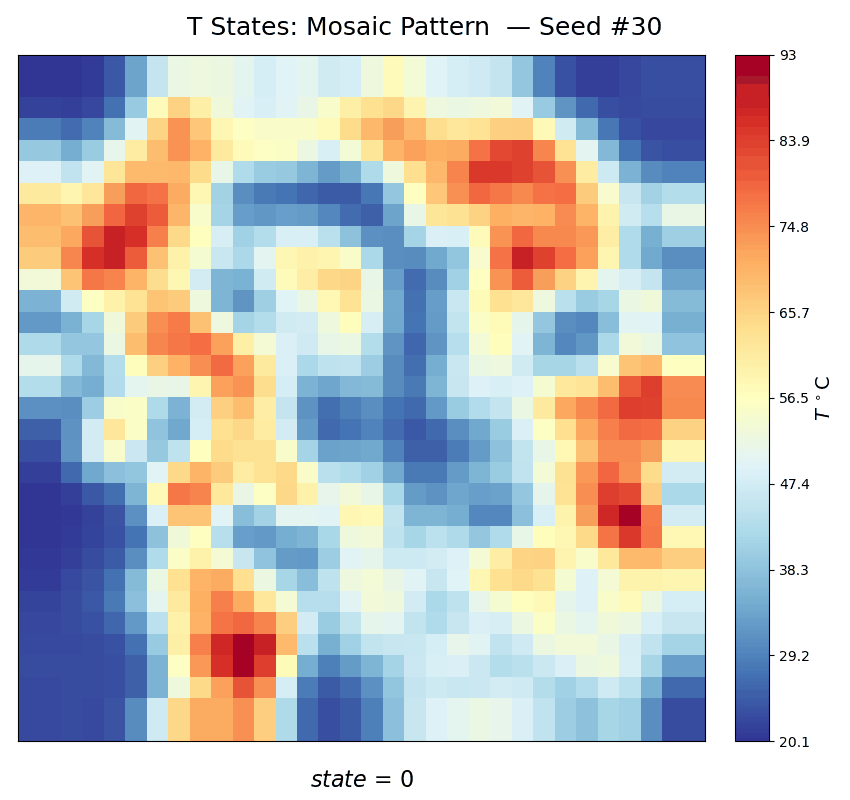
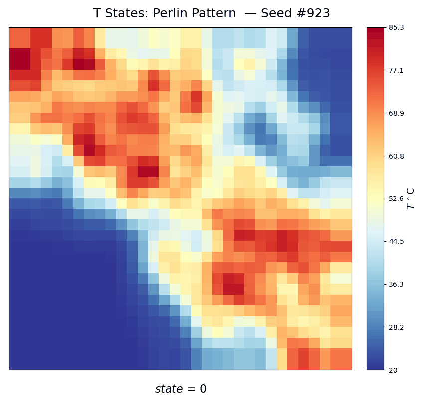
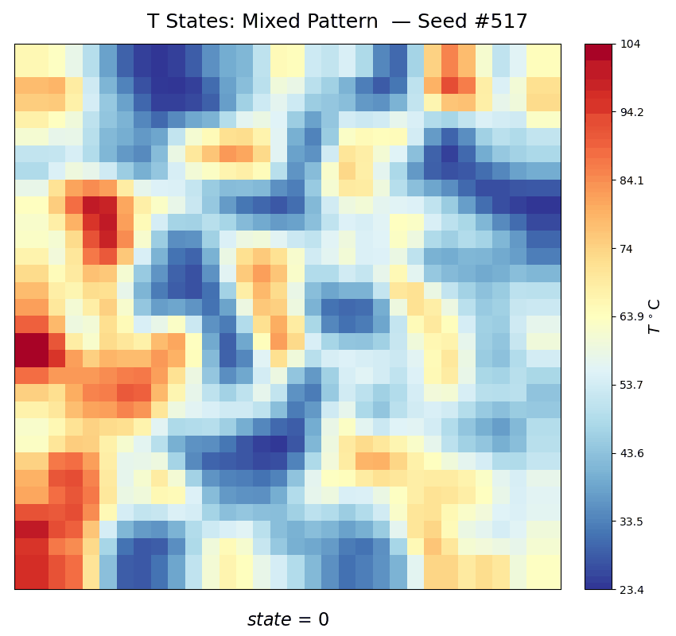
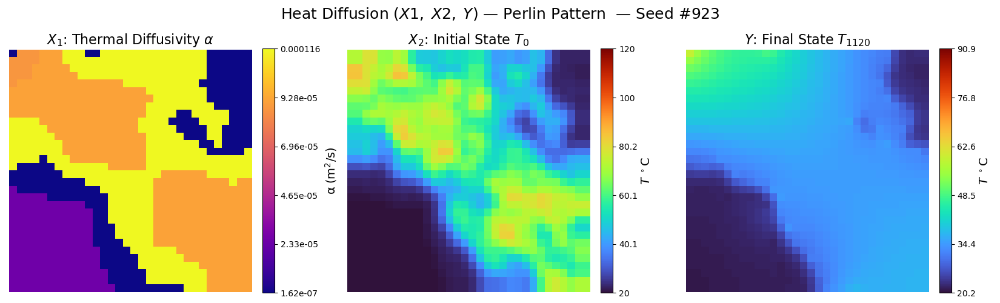

# HEAT_DIFFUSION_SIMULATION

## Create and activate Conda environment

```bash
cd heat_diffusion_simulation
conda env create -f environment.yaml
conda activate heat_env
```

### Notes
- Most of the packages are common, so you may already have these installed


## Test the code

```bash
python -m pytest
```

## Create a dataset

### Program: [create_dataset.py](./create_dataset.py)

#### `create_dataset.py` Command-Line Options

| Option                                | Description                                                        | Choices/Types                                                                              |
|---------------------------------------|--------------------------------------------------------------------|--------------------------------------------------------------------------------------------|
| `-h, --help`                          | Show help message and exit                                         | —                                                                                          |
| `--debug, -d`                         | Enables logging with debug level verbosity                         | Flag (presence means `'On'`)                                                               |
| `--ntasks`                            | Number of parallel tasks (CPU cores)                               | Any integer (e.g., `1`, `4`)                                                               |
| `--seed-step`                         | Number of seeds to be processed and written at a time              | Any integer (default: `100`)                                                               |
| `--min-seed`                          | Start seed for generating simulations                              | Any positive integer (default: `1`)                                                        |
| `--max-seed`                          | End seed for generating simulations                                | Any positive integer (default: `5`)                                                        |
| `--grid-length`                       | Length of one side of 2D grid                                      | Any integer > 4 (default: `32`)                                                            |
| `--convergence-tolerance`             | Tolerance value for determining convergence                        | Any positive float (default: `1e-4`)                                                              |
| `--max-iterations`                    | Maximum Euler integration steps                                    | Any integer (default: `5000`)                                                              |
| `--solver-name`                       | Which solver to use                                                | String options:<br>• `ftcs`<br>• `crank_nicolson`<br>• `backward_euler`<br>default: `crank_nicolson`                  |
| `--boundary-condition`                | Which boundary condition to use                                    | String options:<br>• `dirichlet`<br>• `neumann`<br>• `periodic`<br>default: `neumann`                                    |
| `--pattern-name`                      | Pattern for generating material maps                               | String options:<br>• `mosaic` <br>• `perlin` <br>• `mixed` <br>• `none` <br>default: `none` (random pattern)                            |
| `--output-path`                       | Path to directory to create `--output-folder` and save data        | String (e.g., `"./results"`)                                                               |
| `--output-folder`                     | Output folder name to save simulation data                         | String (default: `"esp_dataset"`)                                                          |
| `--save-states`                       | When to save intermediate states                                   | String options:<br>• `all`<br>• `none`<br>• `interval-<N>`<br>• `first-<N>`<br>• `base-<B>`<br>Multiple options can be chained (e.g. `"first-10,interval-50"`) |


### Example command

```bash
python create_dataset.py \
--output-folder "heat_diffusion_dataset_1k" \
--min-seed 1 \
--max-seed 1000 \
--seed-step 100 \
--ntasks 2 \
--solver-name "crank_nicolson" \
--boundary-condition "neumann" \
--pattern-name "none" \
--convergence-tolerance 1e-4 \
--max-iterations 5000 \
--save-states "first-20,interval-10"
```

> Each simulation run uses a unique seed in range [`--min-seed`, `--max-seed`]
> - This allows simulations to have variable outputs that can be reproduced
> - A preset pattern configuration is selected at random 

## Visualize a dataset

### Program: [visualize_dataset.py](./visualize_dataset.py)

#### `visualize_dataset.py` Command-Line Options
| Option                      | Description                                                                   | Choices/Types                  | Default         |
|-----------------------------|-------------------------------------------------------------------------------|--------------------------------|-----------------|
| `-h`, `--help`              | Show help message and exit                                                    | —                              | —               |
| `-d`, `--debug`             | Enables logging with debug level verbosity                                    | Flag (on if present)           | `false`         |
| `--data-file DATA_FILE`     | Path to the input HDF5 file with saved simulation runs                        | String (file path)             | **required**    |
| `--random-seed RANDOM_SEED`| Random seed for selecting samples                                             | Integer                        | `20`          |
| `--num-samples NUM_SAMPLES`| Number of simulation samples to visualize                                     | Integer                        | `1`             |
| `--output-folder`           | Directory where images and gifs will be saved (created if it doesn't exist)              | String (path to folder)        | **required**    |
| `--gif-fps GIF_FPS`                 | Frames per second for gif playback                                            | Integer                        | `20`            |
| `--gif-delay GIF_DELAY`                 | Delay seconds between gif playback loop                                          | Integer                        | `3`            |
| `--gif-cmap CMAP`               | Colormap for gif plots, perceptually uniform preferred (Matplotlib-compatible)                            | String (e.g. `'RdYlBu_r'`)      | `'RdYlBu_r'`     |
| `--image-cmap CMAP`               | Colormap for image plots, diverging preferred (Matplotlib-compatible)                            | String (e.g. `'turbo'`)      | `'turbo'`     |

### Example command

```bash
python visualize_dataset.py \
--data-file "heat_diffusion_dataset_1k/heat_diffusion_32x32_1-1000.hdf5" \
--output-folder "heat_diffusion_dataset_1k/sample_viz" \
--random-seed 42 \
--num-samples 20 \
--gif-fps 10 \
--gif-delay 5 \
--gif-cmap "RdYlBu_r" \
--image-cmap "turbo"
```


## Sample GIFs and Images


|  |  |  |
|:---:|:---:|:---:|
|  |  |  |

|  |
|:---------:|
|  |
|  |
|  |
